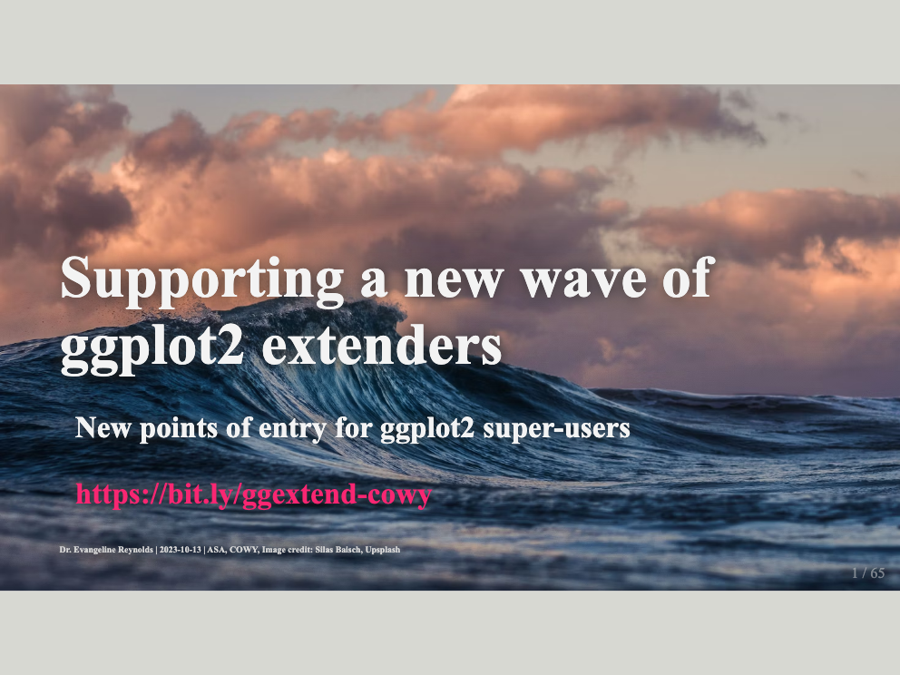
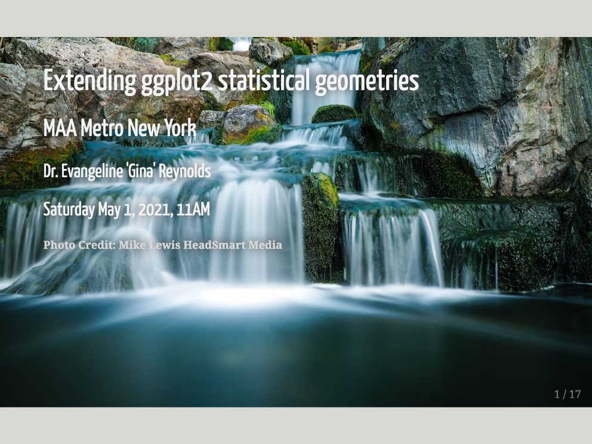

<!-- README.md is generated from README.Rmd. Please edit that file -->

```{r, include = FALSE}
knitr::opts_chunk$set(
  collapse = TRUE,
  comment = "#>",
  fig.path = "man/figures/README-",
  out.width = "100%",
  echo = F
)
```


<br>
<br>


# Evangeline 'Gina' Reynolds, PhD

Welcome to my website! 

Below you'll find talk materials, publications and working papers, software packages, project homepages, and my bio. You can find my CV [**here**](https://evamaerey.github.io/io/reynolds_evangeline_cv.pdf).  To suggest an edit or update, click [ here](https://github.com/EvaMaeRey/io/blob/main/docs/reynolds_evangeline_cv.rnw).


<!-- badges: start -->
<!-- badges: end -->

<!-- 'Do not scatter your energies',  -->

<!-- These days I'm focused a lot on package building.  I need a personal website update update.  Instead of trying to reboot my blogdown website or convert to quarto, I'm just using package building architecture via pkgdown to create an updated personal webpage.   -->

<!-- I may explore some meta package writing here as well.  -->


# Recent Talks


<!-- [](https://codecademy.com) -->

<!-- [](https://codecademy.com) -->

```{r}
my_talks <- tibble::tribble(
  ~short_ref, ~date, ~location, ~title, ~url, ~org,
  "ggplot2_new_wave", "October 2023", "Denver", "A New Wave of ggplot2 Extenders", "https://evamaerey.github.io/mytidytuesday/2023-09-26-cowy-outline/cowy-slides.html#1", "CO-WY Chapter, American Statistical Association",
  "primer_wp", "April 2022", "New York", "Speaking ggplot2", "https://evamaerey.github.io/mytidytuesday/2022-04-21-ggplot2-grammar-primer/ggplot2_grammar_primer.html#1", "West Point Data Analytics Series",
  "stats_geoms_wp", "May 2022", "New York", "Creating new geom_*s for richer statistical storytelling", "https://evamaerey.github.io/mytidytuesday/2022-05-09-statistical-geometries/statistical_geometries.html#2", "West Point Department of Mathematics Speaker Series",
  "ggxmean_maa", "August 2022", "Philadelphia", "Elegant Statistical Narratives with ggxmean: MAA meeting, Poster", "https://github.com/EvaMaeRey/ggxmean/blob/master/docs/philly_poster_screen_shot.png", "Mathematical Association of America",
  "tidypivot_maa", "May 2022", "New York", "tidypivot: declarative table builds", "https://evamaerey.github.io/mytidytuesday/maa_may_2022_presentation.html#1", "Mathematical Association of America - Metro New York",
  "network_du", "April 2020", "Denver", "Intro to Network Analysis and Visualization", "https://evamaerey.github.io/mytidytuesday/2022-05-23-networks-presentation/networks_presentation.html#1", "Korbel School of International Studies, University of Denver",
  "circlepack", "March 2023", "Virtual meeting", "ggcirclepack and beyond: experiments in the compute_panel space, at ggplot2 extenders", "https://evamaerey.github.io/ggcirclepack/circle_pack_and_beyond_talk#1", "ggplot2 extenders meetup",
  "flipbooks", "January 2020", "San Francisco", "Flipbooks", "https://youtu.be/9Sgg1lJRM8c?si=Q28CtH59Df8DRmbI&t=408", "RStudio Conference",
  "shallow_fakes", "May 2019", "Denver", "Shallow Fakes: Assessing the potential for spoofing and faking in data visualization and what to do about it", "URL", "Korbel School of International Studies, University of Denver"
)
my_talks |> dplyr::pull(url) 
```


```{r, eval = F, echo = F}
webshot2::webshot("https://evamaerey.github.io/tidypivot/maa_may_2022_presentation.html#1", "docs/title-slides/tidypivot_maa.png")

webshot2::webshot(url = my_talks$url[1], 
                  file = 
                    paste0("man/title-slides/", my_talks$short_ref[1], ".png"))
```

```{r}
make_png_path <- function(info_frame, which){ 
  paste0("man/title-slides/", info_frame$short_ref[which], ".png")
  }

save_webshot_to_man <- function(info_frame, which){
  
  webshot2::webshot(url = info_frame$url[which], 
                  file = make_png_path(info_frame, which))

}

write_html_hyper_image <- function(info_frame, which){
  
  url <- info_frame$url[which]
  path_png <- make_png_path(info_frame, which)
  
  if(!file.exists(path_png)){
    
    save_webshot_to_man(info_frame, which)
    
  }

  try(
    paste0(
      '<a href="', url,'" width = "33%"></a>'
      ) |> cat()
  )
      
    
  }
  

```


```{r, results = 'asis'}
# dir.create("man/title-slides")
write_html_hyper_image(my_talks, which = 1) 
write_html_hyper_image(my_talks, which = 2) 
# write_html_hyper_image(my_talks, which = 3)
write_html_hyper_image(my_talks, which = 4)
write_html_hyper_image(my_talks, which = 5)
write_html_hyper_image(my_talks, which = 6)
```

```{r, out.width="33%", fig.show='hold', echo = F, eval = F}



knitr::include_graphics("man/figures/title-slides/primer_wp.png")

knitr::include_graphics("man/figures/title-slides/network_du.png")
knitr::include_graphics("man/figures/title-slides/stats_geoms_wp.png")
knitr::include_graphics("man/figures/title-slides/tidypivot_maa.png")

```


# Projects and Goals

## Supporting 'a new wave of ggplot2 extenders'

There is a growing population of ggplot2 ‘super-users’ that – given their regular and long-term ggplot2 use – have a strong working knowledge of grammar of graphics principles and of ggplot2's user interface.  Among their ranks are statistics educators, data visualization professionals, and data scientists and statisticians.

The assertion of this project is that many ggplot2 super-users could find creating ggplot2 extensions very valuable, but that current educational materials are falling short in reaching and enabling many in this group.  I'll then discuss how new material could be tailored to this group and will introduce some such new points of entry.  

<!-- There is a growing population of ggplot2 'super users' that -- given regular and prolonged ggplot2 use -- have a strong working knowledge of the grammar of graphics principles and ggplot2-ic feel and API.  Among the ranks of these super users are statistical educators, data visualization professionals, and seasoned data scientists. -->

<!-- I posit that many folks in this group of super-users could find ggplot2 extension immensely valuable. But that existing materials are falling short in reaching and enabling this group of extraordinary folks in moving into the extension space.   -->

<!-- Specifically, ggplot2 'super users', if provided points of entry tailored to them, would be able to contribute to the ggplot2 extension eco-sphere in thoughtful, grammar-of-graphics-consistent ways.   -->

<!-- And such super-users, are likely to move rapidly into this space given that extension will afford more elegant and efficient workflows. -->

<!-- Investment in ggplot2 extension education for these folks is likely to have many positive externalities.  First, such users are likely to be interested in packaging their materials, providing their elegant and efficient workflow.  This further would strengthen ranks in the R community's package developer base.   -->

<!-- Finally, know-how in the extension space should lead to greater knowledge of the ggplot2 code base and could help build the ggplot2 contributor-maintainer pool of talent. -->

- easy geom recipes: diving into defining compute_group ggprotos

- more geom recipes: cases when compute_group is not enough (compute_panel)

- ggtedius workshop

- Coordinating ggplot2 extenders meetup/support group

```{r, eval = F, out.width="33%", echo = F}
knitr::include_graphics("docs/title-slides/circlepack.png")
```

## Supporting newcomers to data visualization and ggplot2

- ggplot2 flipbook
- a ggplot2 grammar guide

## Supporting statistical learning

- packages focus on intro stats

- ma206data with maintained with statistics faculty West Point's Math 

## Supporting new R package developers

- ggtedius workshop
- readme2pkg and readme as package story, tocs and enumeration of steps  SeeEvaMaeRey/ggsmoothfit
- [A companion guide to Jim Hester's, 'You can make an R package in 20 minutes'](https://evamaerey.github.io/package_in_20_minutes/package_in_20_minutes)


`Books are meant to be read, ... packages are not meant to be read and so I think it is kind' - 'R Packages: Q & A with Jenny Bryan' around 3:00

## Highlighting new opportuties in viz/ggplot2 extension

### Rethinking positional aesthetics (beynod x and y)

- aes(fips = my_fips_var), e.g ggfips
- ggcirclepack
- ggcalendar


### New points of entry as opposed to ggplot(), minimal data transformation and/or defaults

- ggverbatim()
- ggedgelist()
- ggbarlabs()

positional aesthetics

# Packages


```{r, echo = F, fig.height=1.5, fig.width=8}
library(ggstamp)
packages <- c("ggxmean", "ggstamp", "ggverbatim", "ggcirclepack", "ma206\ndistributions", "ma206\nequations", "ggchalkboard", "ggstates", "tidypivot", "ggsmoothfit", "ggsmoothfit", "doublecrochet", "ggdirect", "ggnc", "ggnorthcarolina" )

set.seed(1234678)
ggcanvas() + 
  stamp_polygon(x0y0 = dplyr::sample_n(pos_honeycomb(ncol = 30, n = 120), 100), fill = "goldenrod", size = .6) + 
  # stamp_text(xy = pos_honeycomb(ncol = 5, n = length(packages)), label = packages, size = 3) +
  ggplot2::theme_void() + 
  ggplot2::scale_y_continuous(expand = ggplot2::expansion(mult = c(0, 0)))
  
  
```

```{r, results='asis', echo = F, eval = T}
library(magrittr)
fs::dir_ls("../", ) %>% 
  .[grep(".tar.gz",.)] %>%  
  stringr::str_replace("../", "https://github.com/EvaMaeRey/") %>% 
  stringr::str_remove("_0.0.0.9000.tar.gz|_0.1.0.tar.gz|_1.11.1.tar.gz|_0.0.1.tar.gz") ->
url  


paste0("[",stringr::str_remove(url, "https://github.com/EvaMaeRey/"),"]", "(",url, "), ") %>% cat()
              

```


# unblogs: experiments and code demos

- [mytidytuesday lab book](https://evamaerey.github.io/mytidytuesday/)
- [featurette](https://evamaerey.github.io/featurette/)
- ggpuzzles:  space for untangling gg knots
- hexes Creating some hex stickers for packages


# Bio

Hello and welcome!  I'm a data scientist, software developer, and educator who is passionate about using visualization to facilitate communication about data and in statistical principles.  I'm particularly motivated by the elegance and power of the "Grammar of Graphics" framework, and am exploring how to further empower ggplot2 users to take advantage of the extension space by 1) working on new extension packages for statistical education and 2) providing new points of entry into the ggplot2 world (tutorials/recipes as well as community building).

For the last three years, I've worked in the Dean's Data Cell at the United States Military Academy at West Point in a data analytics and teaching dual role. I worked closely with stakeholders and other members of the data team to deliver actionable insights and meet institutional reporting requirements. I worked on the Deans Data Cell infrastructure towards code-first, reproducible and elegant data products that could be easily interpreted by a wide audience.  I also taught sections of  Introduction to Statistics and Probability (MA206) in the Mathematics Department, and oversaw five independent studies focused on tool-building for statistical education (Brown and McGovern in Fall AY2022, Brown in Spring AY2022, and Folorunso and Jax Spring AY2023).

From Fall AY2018-Spring AY2020, I taught statistical methodology at the University of Denver’s Korbel School of International Studies.  During this period, I won an R Consortium, which allowed me to work with six graduate student researchers to advance that project (Granier, Goodman, Picci, Thapa,  Surrency, Woodrum). I had previously lectured at the Technische Universität Dresden’s Center for International Studies on international organizations and statistical methodology (Spring AY2016 and Spring AY2018).  

My PhD is from the University of Illinois, where my dissertation won Burkholder Award for Best Dissertation in the Political Science Department of the University of Illinois.  I focus was on international institutions and law especially in the area of security. More broadly, my areas of study have been International Relations, Methodology, and Comparative Politics with an emphasis on Latin American Politics. My dissertation focused on compliance with supranational law, focusing on the UN Security Council resolutions as my principle case; I conducted dissertation field research in Brazil in the Federal House of Deputies.

During my PhD, I worked as a statistics consultant, at the Applied Technologies of the Arts and Science (ATLAS), at the University of Illinois from 2013-2015. I also served “Methods TA” in Political Science in the 2015-2016 academic year at the University of Illinois, providing assistance and expertise both to undergraduate and graduate students. At TU Dresden, in 2018, I designed and taught a course introducing students to data science tools and statistical analysis for political research. 

I have been awarded the Fulbright Fellowship (Argentina 2008), Foreign Language and Area Studies Fellowships (2009-2011), Nelle Signor Travel Fellowship (Brazil 2011) and have participated in specialized workshops including the Empirical Implications of Theoretical Models (2010), Public Policy and Nuclear Threats (2013), the Berkeley Institute for Transparency in the Social Sciences (2015) workshops, the Zurich Summer School for Women in Political Methodology (2017), and the Lorentz Workshop: Empirical Research on International Organizations (2018).

Previously to my academic career, I worked at the U.S. Department of Commerce’s Bureau of Industry and Security in chemical and biological export controls and have worked in lithium-ion battery failure diagnostics at the Chemical Engineering Division of Argonne National Laboratory.

